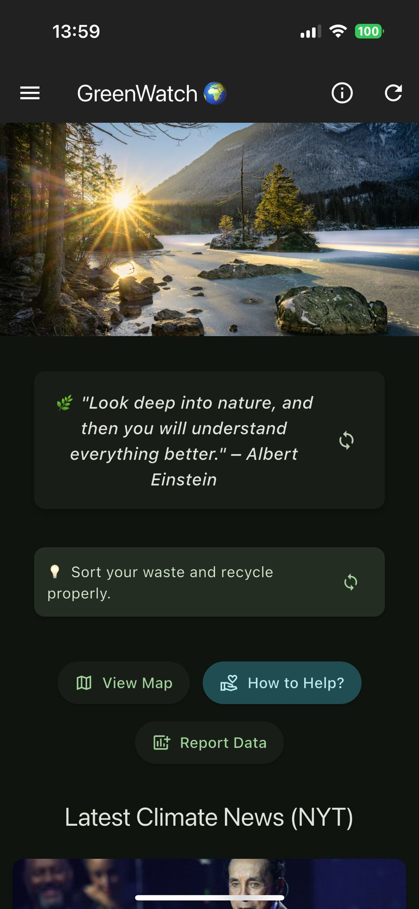
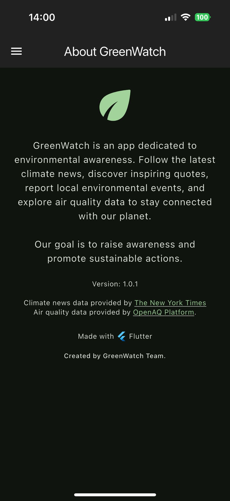
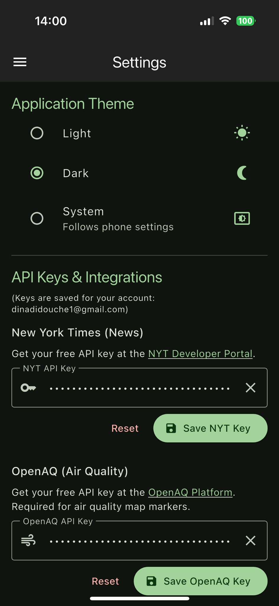

# GreenWatch - Flutter Application

## Github
- Repository: [GreenWatch](https://github.com/lucasbnrd05/flutter_app)
- Releases: [Releases](https://github.com/lucasbnrd05/flutter_app/releases)

## Workspace
- [Sharepoint](https://upm365.sharepoint.com/:u:/r/sites/epitie/SitePages/Tracking-Flutter.aspx?csf=1&web=1&share=ERQ4AecSDGlIjkkjupbnnoIBCgofHk8oxr3feB9Pdgu4Gg&e=QPPVfH)

## Our Website
🔗 [Visit the GreenWatch Website](https://lucasbnrd05.github.io/greenwatch/index.html)

## Description

**GreenWatch** is a cutting-edge Flutter-based mobile application designed to help users monitor and stay informed about the environmental impacts of droughts and floods. With real-time data and predictive analytics, the app empowers individuals, communities, and organizations to stay one step ahead when it comes to managing water-related natural disasters. Whether you’re looking to track ongoing drought conditions or monitor flood risks, GreenWatch provides vital information and updates, ensuring you are always prepared for the unexpected.

The app uses state-of-the-art data sources, including potentially sensors, satellite imagery, and local weather data, to provide real-time insights, predictions, and alerts regarding drought and flood events. It also aims to integrate community-driven reports and observations to create a more comprehensive picture of the environment, offering a powerful tool for decision-makers and concerned citizens alike.

## Environmental Impact & Justification

GreenWatch serves as a proactive environmental monitoring solution that aligns with global efforts to mitigate the effects of climate change. By providing users with real-time insights into drought and flood risks, the app promotes better resource management and early warning systems that can save lives and minimize damage. This app directly contributes to raising awareness about water scarcity, the growing frequency of extreme weather events, and the importance of sustainable water practices.

The application empowers individuals and communities to take informed actions by:
- Providing accessible data on current and predicted environmental conditions.
- Facilitating the reporting and tracking of local environmental events.
- Encouraging preparedness for water-related natural disasters.

By fostering a better understanding of environmental vulnerabilities, GreenWatch plays a crucial role in mitigating the impacts of these devastating events and fostering a more resilient future. It promotes a sense of collective responsibility and action towards environmental stewardship.

## Screenshots and navigation

| Page                     | Screenshot                                   | Description                                                                 |
|--------------------------|----------------------------------------------|-----------------------------------------------------------------------------|
| **Authentication Page**  |         | Login and registration screen. Allows access via Email/Password, Google, or as a Guest (guest experience with limited features). Handles authentication errors through dialogs.  |
| **Map View**      |    | Main interface displaying the OpenStreetMap. Automatically centers the view on the user's current GPS location. Displays custom markers for environmental events (stored in SQFlite) and potentially AQI data. Allows viewing a dynamic route from the user's position to the last recorded event. |
| **Data/Event Entry Page**      |    | Interface allowing users to report or log new environmental events or data (e.g., event type, description, photo, location). This data is then persisted in the SQFlite database. |
| **Home Page**    | | Main page of the application.            |
| **About Page**|    | Provides information about the application: version, developers, licenses used, privacy policy, etc. (Standard feature, not explicitly listed but often present).         |
| **Settings Page**        |      | Allows users to manage their application preferences: theme choice (light/dark, persisted via SharedPreferences), API key management (securely stored per user), and other account settings. Secure access (requires authentication). |

## Demo Video
<div style="text-align: center;">
  
</div>


## Features

-   **Real-time Environmental Monitoring**: Track drought and flood conditions.
-   **Interactive Map Display**: Utilizes OpenStreetMap (via `flutter_map`) to show geographical data.
-   **GPS Location Tracking**: Centers map on current user position and uses GPS for event logging.
-   **Custom Event Markers**: Displays markers on the map for Air Quality Index (AQI) and user-reported/SQFlite-stored environmental events.
-   **Customizable Markers**: Markers can be styled for better visual distinction.
-   **Dynamic Route Drawing**: Visualizes routes on the map (e.g., from user location to the last reported event using PolylineLayer).
-   **User Authentication**:
    -   Secure login/registration via Email & Password (Firebase).
    -   Quick sign-in with Google (Firebase).
    -   Guest mode for anonymous browsing.
-   **Local Data Persistence (SQFlite)**:
    -   Store and manage environmental event data locally.
    -   Full CRUD (Create, Read, Update, Delete) operations for events.
    -   Dedicated screen for viewing event details.
-   **User Preferences**:
    -   Save and apply user-selected themes (Light/Dark Mode).
    -   Store user-specific API keys securely using SharedPreferences.
-   **RESTful API Integration**:
    -   Fetch data from external services (e.g., weather, environmental APIs).
    -   Process and display JSON data.
-   **External Image Display**: Load and show images from URLs.
-   **Informative Dialogs**: User-friendly dialogs for information, confirmations, and error handling (e.g., authentication errors).
-   **Secure Access**: Certain pages like Settings and Data Management are protected and require authentication.

## Technical Features

-   **Framework**: Built with Flutter for cross-platform mobile development.
-   **Mapping**: `flutter_map` package for OpenStreetMap integration.
-   **Location Services**: Utilizes device GPS for location data.
-   **Local Storage**:
    -   `sqflite` for structured relational data (events).
    -   `shared_preferences` for simple key-value data (user settings, API keys, theme).
-   **Backend & Authentication**: Firebase (Authentication for Email/Password & Google Sign-In).
-   **Networking**: `http` package for making RESTful API calls.
-   **JSON Handling**: Built-in Dart and Flutter capabilities for JSON parsing.
-   **UI Components**: Standard and custom Flutter widgets, theme customization.
-   **Navigation**: Flutter's declarative routing and navigation system.
-   **State Management**: (Specify if a particular package like Provider, BLoC, Riverpod, GetX is used, otherwise implicit via StatefulWidget/InheritedWidget).
-   **Development Environment**: Android Studio / VS Code with Flutter & Dart SDKs.
-   **Version Control**: Git & GitHub.

## How to use

1.  **Prerequisites**:
    *   Ensure you have the Flutter SDK installed and configured.
    *   An Android Emulator or a physical Android device.
    *   For Firebase features: A Firebase project set up with this app, and the `google-services.json` file placed in `android/app/`.

2.  **Clone the Repository**:
    ```bash
    git clone https://github.com/lucasbnrd05/flutter_app.git
    cd flutter_app
    ```

3.  **Install Dependencies**:
    ```bash
    flutter pub get
    ```

4.  **Run the Application**:
    *   Make sure an emulator is running or a device is connected.
    *   Execute the command:
        ```bash
        flutter run
        ```

## Participants
- **Lucas BERNARDEAU** (lucas.bernardeau@alumnos.upm.es)
- **Nathan VANATHATHAN** (nathan.vanathathan@alumnos.upm.es)
- **Dina DIDOUCHE** (dina.didouche@alumnos.upm.es)

**Workload distribution**: (33% / 33% / 33%).